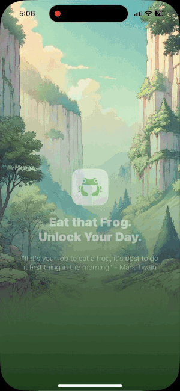
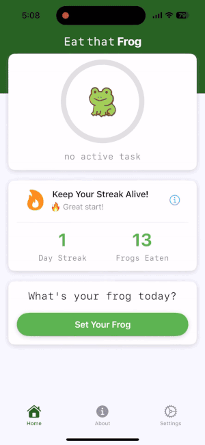
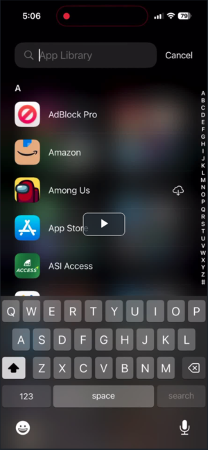

# 🐸 Eat That Frog – iOS Productivity App

[Click me to visit the website!](https://eatthatfrog.carrd.co) - **Made a quick website for users of the app.**

After seeing my screen time hit 8+ hours a day, I built **Eat That Frog** as a fun and effective way to break stop doomscrolling.  
Inspired by Brian Tracy’s **Eat That Frog** method, the app helps users tackle their most important task first, while blending **behavioral design, habit-building, and playful micro-interactions**.

--- 

## 🚀 Onboarding

- **Interactive onboarding flow** with a short survey to capture user habits and goals.  
- Instantly **generates a personalized screen-time reduction plan** based on survey inputs.  
- **Responsive, animated UI** with sound effects and haptic feedback to make it feel alive.  
- A **story-style preview** that mirrors familiar social media formats, keeping the learning curve intuitive.  
- Onboarding designed as more than just a tutorial, it’s an **emotional hook** that motivates users from the get go.
- **Dynamic paywall testing** powered by $uperwall API to identify the highest-performing paywall strategy (not fully complete).

  
---

## 📱 Core App Features

- Add, edit, and delete tasks in a clean, intuitive interface.  
- **Prioritize tasks** to focus on the “frog” first.  
- **Pick distracting apps** to lock away when starting a task, apps remain inaccessible until it’s completed.  
- **Apple Screen Time API integration** to securely lock apps, with full Apple Authentication for token/data access.  
- **Mark tasks as complete** with immersive feedback.  
- **Custom mindfulness and meditation exercises**, enhanced with haptics and animations, to keep users accountable and bring focus back to the moment.  
- **Different difficulty modes and Screen Time plans** for users to choose from.  
- **Fun effects, sounds, and interactive elements** throughout the experience.  

---

## ✅ Closing Notes

- Fully designed and **functional iOS app**, not just a prototype.  
- Complete **product vision**, from onboarding to monetization.
- Clear **market audience**: students, professionals, and anyone struggling with distraction and phone overuse.  
- Positioned as both a **productivity tool** and a **wellness tool**.
- A product that blends **psychology, design, and technology** to help users reclaim their time.  

---

## 🛠️ Tech Stack

- **Swift / SwiftUI** – core iOS development.
- **Apple Screen Time API** – app-locking.
- **$uperwall** – dynamic paywall testing.  
- **Figma** – design, prototyping, and UI/UX iterations. 

---

## 🎥 Full Demo

---

## 👤 Author

Built by [Yusuf Kuru](https://github.com/yusufcku)  

---
